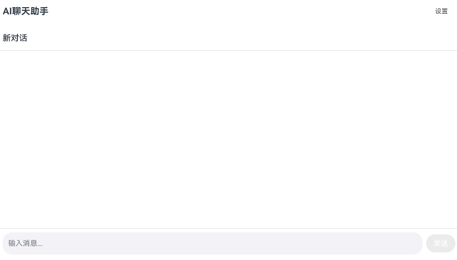
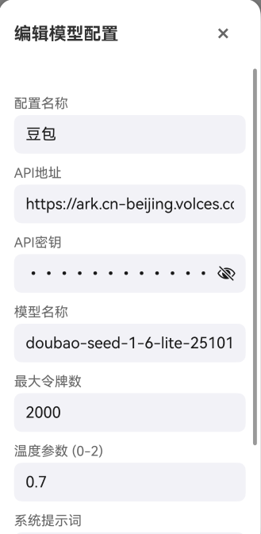

# HarmonyOS AI聊天应用

一个功能完整的HarmonyOS AI聊天应用，支持接入多种大模型API。

## 功能特性

### 大模型API支持
- **OpenAI**: GPT-3.5, GPT-4, GPT-4 Turbo
- **豆包**：不推荐doubao1.6lite，退化过于严重，建议选用1.8以上版本
-  **百度文心一言**: ERNIE Bot系列
-  **阿里通义千问**: Qwen系列
-  **其他OpenAI兼容API**

### 配置管理
- 可视化配置界面
- 多配置管理
- 连接测试功能
- 配置验证
- 默认配置设置

### 人格模板
- 预设人格模板
- 自定义模板
- 快速切换
- 模板管理

### 聊天功能
- 多会话管理
- 会话历史
- 消息记录
- 自动保存

#### 会话界面
应用采用简洁直观的会话界面设计，主要包含以下组成部分：

- **顶部标题栏**：左侧显示"AI聊天助手"标题，右侧提供"设置"按钮用于配置管理
- **对话区域**：显示用户与AI的对话历史，支持"新对话"标签管理多个会话
- **底部输入栏**：包含输入框和发送按钮，用户可在此输入消息并与AI交互

界面特点：
- 极简设计风格，聚焦核心对话功能
- 清晰的交互流程，降低用户学习成本
- 响应式布局，适配移动端和桌面端
- 支持深色模式，提供舒适的视觉体验



### 用户界面
- 流畅交互体验
- 响应式布局
- 深色模式支持

### 多端部署
- **响应式断点系统**：支持 xs（穿戴）、sm（手机）、md（平板）、lg（大屏）四种断点
- **自适应布局**：根据设备屏幕尺寸自动调整布局参数（间距、列数、字体大小等）
- **多设备适配**：一套代码适配手机、平板、折叠屏、智能穿戴等多种设备
- **动态监听**：实时监听窗口尺寸变化，动态调整界面布局

## 快速开始

### 1. 配置API

1. 打开应用，点击右上角"设置"按钮
2. 在"AI模型配置"区域点击"添加配置"
3. 填写API信息（参考[API配置指南](docs/API配置指南.md)）
4. 点击"测试连接"验证配置
5. 保存配置并设为默认


### 2. 开始聊天

1. 返回主界面
2. 在输入框输入消息
3. 点击发送按钮
4. 等待AI回复

## 项目结构

```
MyApplication2/
├── entry/
│   └── src/main/ets/
│       ├── model/
│       │   └── ChatModel.ets          # 数据模型
│       ├── service/
│       │   ├── AIService.ets          # AI服务
│       │   └── StorageService.ets     # 存储服务
│       └── pages/
│           ├── Index.ets              # 主页面
│           └── SettingsPage.ets       # 设置页面
├── common/
│   └── src/main/ets/
│       ├── utils/
│       │   └── BreakpointSystem.ets   # 断点系统
│       └── components/
│           └── ResponsiveLayout.ets   # 响应式布局组件
└── docs/
    └── API配置指南.md                  # 详细配置文档
```

## 核心组件

### AIService
负责与大模型API通信：
- 支持多种API格式
- 自动适配不同响应格式
- 错误处理和重试机制

### StorageService
负责数据持久化：
- 会话历史存储
- 配置信息管理
- 人格模板管理

### SettingsPage
提供完整的配置界面：
- API配置表单
- 连接测试
- 人格模板管理
- 应用设置

### BreakpointSystem
响应式断点系统：
- 支持四种断点：xs（0-320vp）、sm（320-600vp）、md（600-840vp）、lg（840vp+）
- 实时监听窗口尺寸变化
- 全局状态管理（V2装饰器）
- 自动计算当前断点

### ResponsiveLayout
响应式布局组件：
- ResponsiveContainer：自适应容器，根据断点调整内边距
- ResponsiveGrid：自适应网格，根据断点调整列数
- ResponsiveText：自适应文本，根据断点调整字体大小

## 技术栈

- **HarmonyOS**: 原生应用开发框架
- **ArkTS**: TypeScript扩展语言
- **ArkUI**: 声明式UI框架
- **HTTP**: 网络请求
- **Preferences**: 本地存储

## API配置示例

### OpenAI
```typescript
{
  name: "OpenAI GPT-3.5",
  apiUrl: "https://api.openai.com/v1/chat/completions",
  apiKey: "sk-xxxxxx",
  model: "gpt-3.5-turbo",
  maxTokens: 2000,
  temperature: 0.7
}
```

### 百度文心一言
```typescript
{
  name: "文心一言",
  apiUrl: "https://aip.baidubce.com/rpc/2.0/ai_custom/v1/wenxinworkshop/chat/completions",
  apiKey: "your-access-token",
  model: "ernie-bot-4",
  maxTokens: 2000,
  temperature: 0.7
}
```

### 阿里通义千问
```typescript
{
  name: "通义千问",
  apiUrl: "https://dashscope.aliyuncs.com/api/v1/services/aigc/text-generation/generation",
  apiKey: "sk-xxxxxx",
  model: "qwen-turbo",
  maxTokens: 2000,
  temperature: 0.7
}
```

### 豆包
```typescript
{
  name: "豆包",
  apiUrl: "https://ark.cn-beijing.volces.com/api/v3/chat/completions",
  apiKey: "your-api-key-here",
  model: "doubao-1.8-pro-32k", // 推荐使用1.8以上版本
  maxTokens: 2000,
  temperature: 0.7
}
```

## 安全建议

## **重要提示**:
1. 不要在代码中硬编码API密钥
2. 不要分享你的API密钥
3. 定期更换API密钥
4. 监控API使用量和费用
5. 合理设置最大令牌数

## 常见问题

### Q: 连接失败怎么办？
A: 检查API密钥、地址是否正确，网络是否正常，API余额是否充足。

### Q: 如何切换不同的模型？
A: 在设置页面可以添加多个配置，点击"设为默认"切换。

### Q: 如何自定义AI的回复风格？
A: 使用人格模板功能，创建自定义提示词。

### Q: 数据存储在哪里？
A: 使用HarmonyOS Preferences API进行本地存储。

## 开发说明

### 构建项目
```bash
hvigorw assembleHap
```

### 运行项目
在DevEco Studio中点击运行按钮。

### 修改配置
所有配置在 `entry/src/main/ets/service/StorageService.ets` 中定义。

## 更新日志

### v1.1.0 (2026-06-16)
- 新增多端部署支持
- 实现响应式断点系统（xs/sm/md/lg）
- 添加自适应布局组件
- 支持手机、平板、折叠屏、智能穿戴等多设备适配
- 优化UI在不同屏幕尺寸下的显示效果

### v1.0.0 (2026-04-20)
-  完整的大模型API接入功能
-  可视化配置界面
-  多种API支持
-  人格模板功能
-  会话管理
-  数据持久化

## 许可证

MIT License

## 贡献

欢迎提交Issue和Pull Request！

## 联系方式

如有问题，请查看[API配置指南](docs/API配置指南.md)或提交Issue。